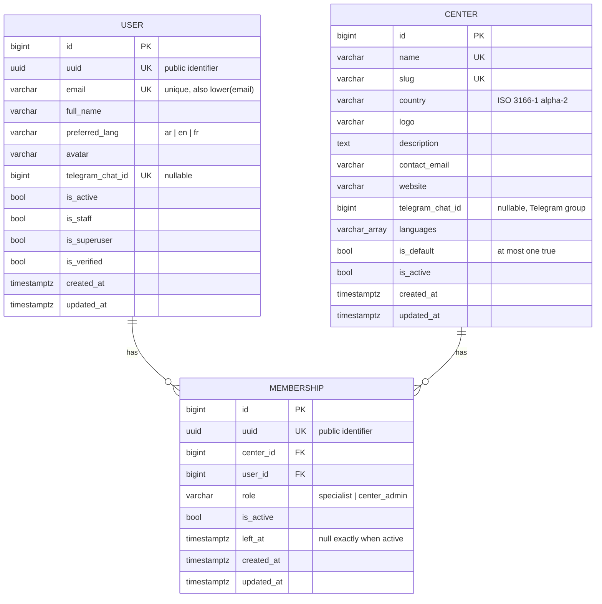

# Data model

Field-level details: [Models reference](../reference/models.md).

## Entity-relationship diagram

`User` also has Django's `groups` and `user_permissions` many-to-many tables
(`PermissionsMixin`), omitted above.

## Referential actions

| From | To | `on_delete` | Why |
| --- | --- | --- | --- |
| `Membership.user` | `User` | `CASCADE` | A membership has no meaning without its user. Users are deactivated, not deleted, in normal operation. |
| `Membership.center` (via `CenterLinkedModel`) | `Center` | `CASCADE` | Every center-owned row belongs to the center; deleting a center removes its data. Centers are deactivated in normal operation. |
| `created_by` (via `CreatedByMixin`) | `User` | `SET_NULL` | Content must survive the deletion of its author. Not yet used by a concrete model. |

## Database constraints

Constraints are enforced by PostgreSQL, so they also hold for bulk updates, raw SQL and
concurrent requests. Each one also has a translated `violation_error_message`, reported
by `full_clean()`.

| Table | Constraint | Kind | Rule |
| --- | --- | --- | --- |
| `core_user` | `email` unique | unique | Exact email unique. |
| `core_user` | `unique_user_email_ci` | unique expression | `LOWER(email)` unique: emails differing only in case are the same account. |
| `core_user` | `uuid` unique | unique | Public identifier. |
| `core_user` | `telegram_chat_id` unique | unique | One account per Telegram chat; several NULLs allowed. |
| `core_center` | `name`, `slug` unique | unique | |
| `core_center` | `only_one_default_center` | partial unique | `UNIQUE (is_default) WHERE is_default`. |
| `core_membership` | `uuid` unique | unique | |
| `core_membership` | `unique_active_membership` | partial unique | `UNIQUE (user_id, center_id) WHERE is_active`. |
| `core_membership` | `membership_active_matches_left_at` | check | Active with no `left_at`, or inactive with `left_at`. |

## Rules outside the database

"A center keeps at least one active center admin" involves several rows and is enforced
by `core.services.memberships` under row locks, not by a constraint.

## Extensions

`vector` (pgvector) is enabled by the first operation of `core/migrations/0001_initial.py`
([ADR 0003](decisions/0003-pgvector-in-initial-migration.md)). No table uses it yet.
