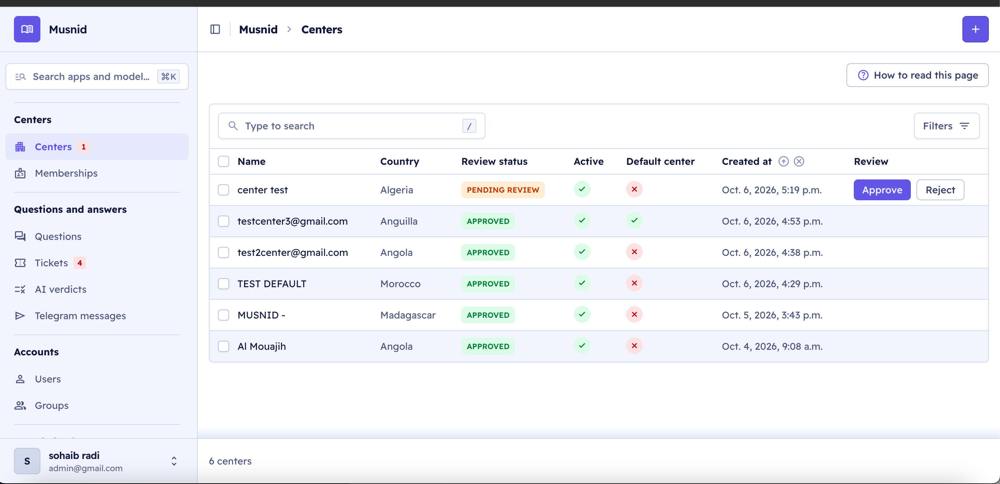
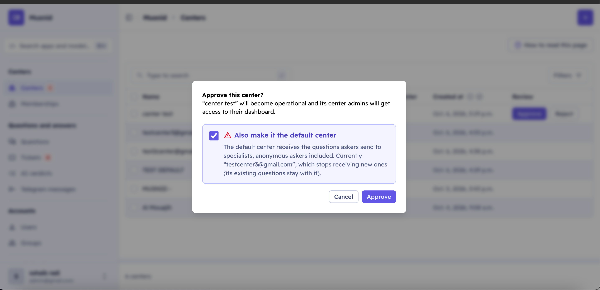

# Approve a center

A center that registers on the website starts **pending review**. Until a platform
administrator (superuser) approves it in the admin, its center admin sees a "being reviewed"
page on the website and cannot use the center dashboard: settings, specialists, questions
and the Telegram connection. The
same step can make it the **default center**, the one that receives the questions askers
send to specialists.

Admin address: `https://api.musnid.online/admin/` (sign in with a superuser account).

## 1. Open the centers list and click Approve

In the sidebar, open **Centers**. The badge next to it counts the centers waiting for
review. A pending center shows **Pending review** and, in the **Review** column, the
**Approve** and **Reject** buttons.

## 2. Confirm in the dialog, and choose whether it becomes the default

The dialog says what approval does: the center becomes operational and its center admins
get access to their dashboard.

The red-marked card **Also make it the default center** is optional:

- **Tick it** when this center should receive the questions askers send to specialists
  (anonymous askers included), for example a center created for a demonstration. The card
  names the current default center, which stops receiving new questions; its existing
  questions stay with it.
- **Leave it unticked** to approve the center without changing where questions go.

Click **Approve**.

## 3. Check the result

The page shows "“
” was approved." (or "… was approved and is now the default
center."). In the list, its **Review status** becomes **Approved** and, if you ticked the
card, the **Default center** column shows a green ✓ on this center only.

## Related

- **Reject** opens a dialog asking for a reason, shown to the applicant.
- An approved center can be made the default later with **Make default** at the top of its
  page.
- After approval, its center admin connects Telegram from the dashboard and adds
  specialists ([Telegram bot](../reference/telegram-bot.md)).
- Every rule behind these buttons: [Admin reference](../reference/admin.md#centers-centeradmin).
